# ESP32-S3 Crankshaft Signal Generator — Architectural Overview

> [!NOTE]
> This document provides a comprehensive architectural map of the entire codebase. Each diagram section focuses on a different dimension of the system: class hierarchy, data flow, initialization, task scheduling, and UI event routing. Together they form a complete conceptual reference.

---

## 1. System-Level Architecture — Dual-Core Task Map

This is the top-level view. The ESP32-S3 has two cores, and this firmware deliberately pins work to each core for deterministic timing.

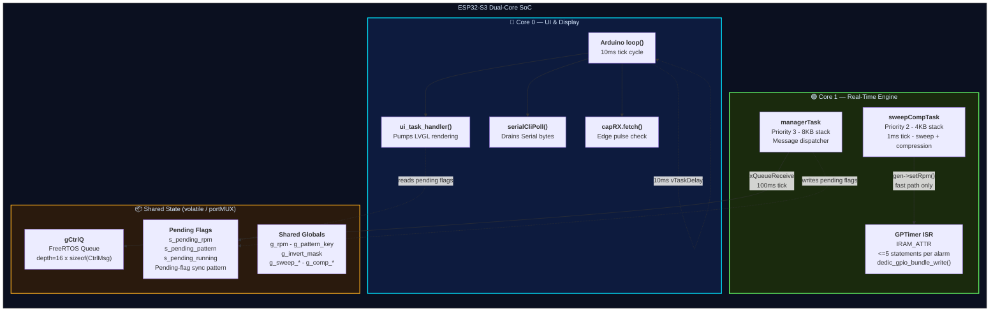

---

## 2. Class Hierarchy & Interface Contract

The generator backend is polymorphic — an abstract `IGenerator` interface allows swapping between the legacy timer-based generator and the production byte-table backend via a build flag.

```mermaid
classDiagram
    direction TB

    class IGenerator {
        <<interface · abstract>>
        +begin(pin_crank, pin_cam1, pin_cam2) bool
        +apply(PatternRef ref, uint32_t rpm) bool
        +setRpm(uint32_t rpm) bool*
        +setInverted(uint8_t channel_mask) void
        +getInverted() uint8_t
        +start() bool
        +stop() bool
        +getEdgeCounter() uint16_t*
        +lastError() GenError
        +isReady() bool
        +getCycleStartUs() uint32_t*
        +getCycleDurationUs() uint32_t*
    }
    note for IGenerator "§3.2 contract\n─────────────────────\n• setRpm() = fast path (no buffer rebuild)\n  used by sweep task at 1ms cadence\n• apply() = full rebuild, not ISR-safe\n• getEdgeCounter() = lock-free atomic\n  uint16 read (Xtensa aligned)\n• * = pure virtual methods"

    class TimerCkpGenerator {
        <<DEPRECATED · WROOM only>>
        -_pin: int
        -_timer: hw_timer_t*
        -_slotPeriod_us: volatile uint32_t
        -_slotsPerRev: volatile uint32_t
        -_invertMask: volatile uint8_t
        -_edge_counter: volatile uint16_t
        -_synth_table: uint8_t*
        +applySignalConfig(SignalConfig cfg) bool
        -onTimer() void [ISR]
        -writePin(bool level) void
    }
    note for TimerCkpGenerator "Legacy slot-machine ISR\n• Single crank pin only\n• cam1/cam2 accepted but parked\n• Uses Arduino esp32-hal-timer\n• apply(PatternRef) = best-effort stub"

    class TableCkpGenerator {
        <<PRODUCTION · S3>>
        -_pin_crank: int
        -_pin_cam1: int
        -_pin_cam2: int
        -_bundle_width: uint8_t
        -_bundle_mask: uint8_t
        -_table: const uint8_t*
        -_slot_count: uint16_t
        -_edge_counter: volatile uint16_t
        -_invert_mask: volatile uint8_t
        -_reverse: volatile bool
        -_cycle_start_us: volatile uint32_t
        -_cycle_duration_us: volatile uint32_t
        -_timer: gptimer_handle_t
        -_bundle: dedic_gpio_bundle_handle_t
        -_playback_buffer: uint8_t* [24KB]
        +setReverse(bool) void
        -onAlarm() bool [ISR · IRAM]
        -reprogramAlarm(uint32_t rpm) bool
    }
    note for TableCkpGenerator "Native byte-table backend\n─────────────────────────\n• ESP-IDF GPTimer (1MHz tick)\n• dedic_gpio bundle write (atomic\n  3-channel GPIO in single call)\n• ISR ≤ 5 statements rule:\n  1) byte = table[edge] XOR mask\n  2) bundle_write(byte)\n  3) advance + wrap\n  4) commit counter\n  5) return false\n• Timer formula:\n  period_μs = 60,000,000 / (rpm × slots)"

    IGenerator <|-- TimerCkpGenerator : implements
    IGenerator <|-- TableCkpGenerator : implements

    class PatternRef {
        <<struct · POD>>
        +table: const uint8_t*
        +slot_count: uint16_t
        +degrees: uint16_t
        +rpm_scaler: float
        +channel_mask: uint8_t
        +name_key: const char*
    }
    note for PatternRef "Byte encoding per slot:\n  bit0 = crank\n  bit1 = cam1\n  bit2 = cam2\n  bit3 = knock (reserved)\nLifetime:\n  Builtin → .rodata (flash)\n  User/DSL → PSRAM heap"

    class SignalConfig {
        <<struct · legacy POD>>
        +rpm: uint32_t
        +nTeeth: uint16_t
        +pMiss: uint8_t
        +nMiss: uint8_t
        +gapPos: GapPosition
        +gapLvl: bool
    }

    class GenError {
        <<enum : uint8_t>>
        OK
        NOT_INITIALIZED
        NO_TABLE
        BAD_SLOT_COUNT
        BAD_RPM
        TIMER_FAIL
        GPIO_FAIL
        BUFFER_OVERFLOW
    }

    TableCkpGenerator ..> PatternRef : "plays back table[]"
    IGenerator ..> GenError : "returns"
    IGenerator ..> PatternRef : "apply(ref, rpm)"
    TimerCkpGenerator ..> SignalConfig : "applySignalConfig()"
```

---

## 3. Boot & Initialization Sequence

The `setup()` function follows a strict initialization order. Each subsystem must succeed before the next depends on it.

```mermaid
flowchart TD
    BOOT["⚡ **Power On / Reset**"] --> SERIAL["`**Serial.begin(921600)**
    Debug output`"]
    SERIAL --> DIAG["`**Boot diagnostics**
    Flash size, PSRAM, heap`"]
    DIAG --> FS["`**initLittleFS()**
    Mount LittleFS partition
    (no-op on WROOM)`"]
    FS --> FS_SMOKE["`**littleFsSmokeTest()**
    Write + readback /test.txt`"]

    FS_SMOKE --> NVS_BEGIN["`**NvsStore::begin()**
    Open 'siggen' namespace
    Schema v1 check + migration`"]
    NVS_BEGIN --> NVS_LOAD["`**NvsStore::loadAllToGlobals()**
    Populate g_rpm, g_pattern_key,
    g_invert_mask, g_sweep_*, g_comp_*
    Missing keys -> factory defaults`"]

    NVS_LOAD --> GEN_INIT["`**gGen.begin(PIN17, PIN9, PIN14)**
    Constructor: TableCkpGenerator()
    - Validate all 3 GPIO pins
    - Create GPTimer @ 1MHz
    - Build dedic_gpio bundle`"]

    GEN_INIT --> SWP_INIT["`**sweepCompressionInit(&gGen)**
    - Create mutex
    - Spawn sweepCompTask
      Core 1, Priority 2, 4KB`"]

    SWP_INIT --> CAP_INIT["`**capRX.begin(PIN18)**
    EdgePulseCapture ISR setup`"]

    CAP_INIT --> UI_INIT["`**ui_init(callbacks...)**
    - lv_init() + display driver
    - Touch controller (GT911)
    - Build LVGL widget tree
    - 480x272 landscape`"]

    UI_INIT --> QUEUE_CREATE["`**xQueueCreate(16, sizeof(CtrlMsg))**
    gCtrlQ - central command queue`"]

    QUEUE_CREATE --> TASK_CREATE["`**xTaskCreatePinnedToCore()**
    managerTask, 'managerTask',
    8192, nullptr, priority=3,
    nullptr, core=1`"]

    TASK_CREATE --> RESTORE_PAT["`**Restore Pattern from NVS**
    findByKey(g_pattern_key)
    -> fallback builtinByIndex(0)
    -> gGen.apply(ref, rpm)`"]

    RESTORE_PAT --> RESTORE_SWEEP["`**Restore Sweep + Compression**
    sweepSet(saved_config)
    compressionSet(saved_config)`"]

    RESTORE_SWEEP --> RESTORE_INV["`**Restore Invert Mask**
    gGen.setInverted(g_invert_mask)`"]

    RESTORE_INV --> START["`**gGen.start()**
    Enable GPTimer alarm
    ISR begins firing`"]

    START --> CLI_INIT["`**serialCliBegin()**
    Serial CLI ready`"]

    CLI_INIT --> UI_SYNC["`**UI sync**
    update_rpm, pattern,
    running, inverted, channels`"]

    UI_SYNC --> LOOP_START["`**-> loop() begins**
    10ms cadence forever`"]

    style BOOT fill:#1a3a1a,stroke:#66FF66,stroke-width:2px,color:#D7E9FF
    style LOOP_START fill:#0d2b4e,stroke:#00E5FF,stroke-width:2px,color:#D7E9FF
    style GEN_INIT fill:#2a1a0d,stroke:#FFB020,stroke-width:2px,color:#D7E9FF
    style TASK_CREATE fill:#2a1a0d,stroke:#FFB020,stroke-width:2px,color:#D7E9FF
```

---

## 4. Message Queue Control Flow — The `CtrlMsg` Dispatch

All user inputs (touch screen, serial port) are funneled through a single FreeRTOS queue. The manager task on Core 1 is the **sole consumer**. This is the central nervous system of the firmware.

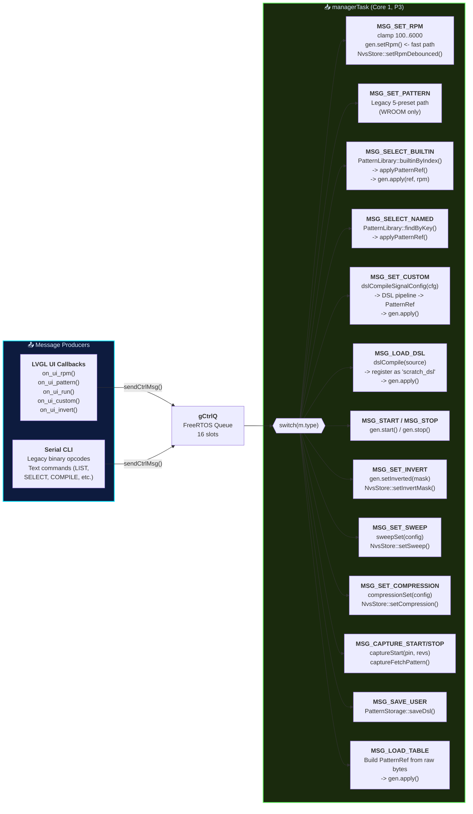

---

## 5. LVGL UI Architecture — Pages, Events & Cross-Core Sync

The UI runs on Core 0. It **never** calls the generator directly — all commands go through `gCtrlQ`. State updates from the backend use a "pending-flag" pattern protected by `portMUX`.

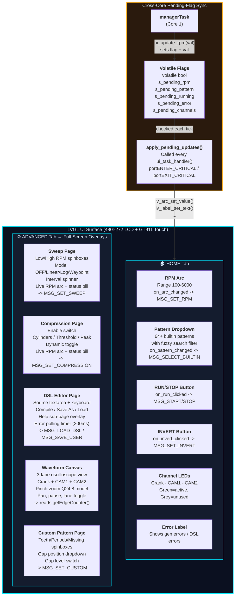

---

## 6. DSL Compiler Pipeline

The Domain-Specific Language lets users define arbitrary crank/cam patterns at runtime. The pipeline is a classic compiler chain.

```mermaid
flowchart LR
    SRC["`**DSL Source String**
    '1,C,M,1/2,60,58t,2m'`"]

    subgraph PIPELINE["DSL Compiler Pipeline (lib/dsl/)"]
        direction LR
        LEX["`**Lexer**
        Tokenizer
        ---------
        TOK_INT - TOK_FRACTION
        TOK_INT_SUFFIXED
        TOK_LETTER - TOK_COMMA
        TOK_COLON - TOK_EOF`"]

        PARSE["`**Parser**
        Recursive Descent
        ---------------
        ProgramAst {
          wheels: WheelDef[]
        }
        WheelDef {
          pin, rotation, kind,
          duty, total_teeth,
          runs[], angular[]
        }`"]

        VAL["`**Validator**
        12 Semantic Rules (section 7.5)
        -----------------
        #1 pin in {1..4}
        #2 pins unique
        #3 duty 0 < n < d, d <= 32
        #4 teeth > 0
        #5 sum(t+m)=teeth
        #9 table <= 4096 slots
        #11 source <= 512 chars`"]

        COMP["`**Compiler**
        AST -> Byte Table
        -----------------
        - Compute LCM across wheels
        - Pack bit0=crank, bit1=cam1
          bit2=cam2 per slot
        - Allocate in PSRAM via
          heap_caps_malloc(SPIRAM)`"]

        LEX -->|"Token stream"| PARSE
        PARSE -->|"ProgramAst*"| VAL
        VAL -->|"validated AST"| COMP
    end

    SRC --> LEX

    RESULT["`**DslResult**
    {
      ok: bool
      pattern: PatternRef
      error[96]
      error_offset
    }`"]

    COMP --> RESULT

    SIGCFG["`**SignalConfig**
    Legacy custom modal`"]
    SHIM["`**dslCompileSignalConfig()**
    Synthesizes DSL source
    from teeth/miss params
    then feeds dslCompile()`"]

    SIGCFG --> SHIM
    SHIM --> SRC

    style PIPELINE fill:#141C2E,stroke:#00E5FF,stroke-width:2px,color:#D7E9FF
```

---

## 7. Pattern Library & Storage Tiers

Patterns come from three sources, managed by the `PatternLibrary` namespace and persisted by `PatternStorage` / `NvsStore`.

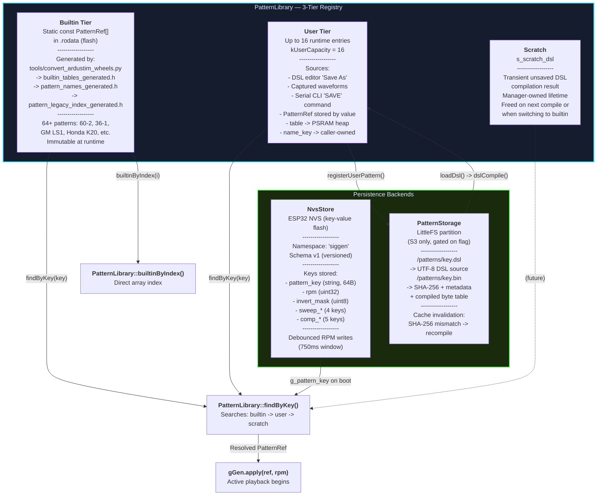

---

## 8. Sweep & Compression Simulation Task

This FreeRTOS task modulates the generator RPM in real-time, simulating engine sweep profiles and compression effects using sin lookup tables.

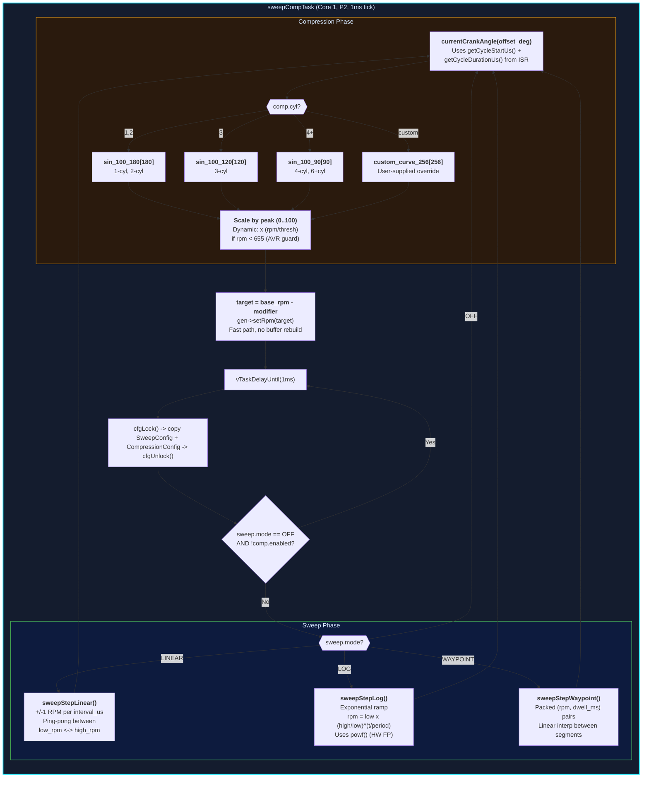

---

## 9. Capture & Loopback Subsystem

The system can capture external CKP signals and validate its own output via a loopback path.

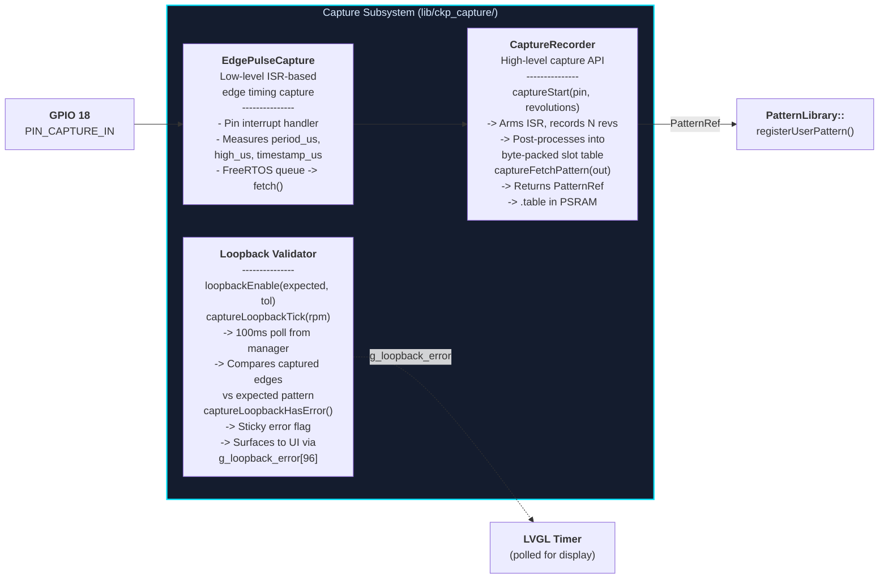

---

## 10. Complete Module Dependency Map

This shows which source file depends on which, revealing the layered architecture.

```mermaid
flowchart TB
    subgraph MAIN["src/main.cpp — Integration Point"]
        MAIN_FILE["`**main.cpp**
        setup() + loop() + managerTask()
        Wires all modules together
        Owns gCtrlQ, gGenInstance,
        gActivePattern, gCfg`"]
    end

    subgraph GEN["lib/ckp_gen/ — Signal Generation"]
        PREF["`**PatternRef.h**
        Universal pattern handle`"]
        IGEN["`**CkpGenerator.h/.cpp**
        IGenerator interface +
        TimerCkpGenerator`"]
        TGEN["`**TableCkpGenerator.h/.cpp**
        GPTimer + dedic_gpio
        byte-table playback`"]
    end

    subgraph PAT["lib/patterns/ — Pattern Registry"]
        PLIB_SRC["`**PatternLibrary.h/.cpp**
        3-tier registry`"]
        BUILTIN_GEN["`**builtin_tables_generated.h**
        ~127KB .rodata tables`"]
        NAMES_GEN["`**pattern_names_generated.h**
        Friendly display names`"]
        LEGACY_GEN["`**pattern_legacy_index_generated.h**
        Ardu-Stim index migration`"]
    end

    subgraph DSL["lib/dsl/ — DSL Compiler"]
        DSL_H["`**Dsl.h**
        Public API`"]
        LEXER["`**Lexer.h/.cpp**
        Tokenizer`"]
        PARSER["`**Parser.h/.cpp**
        Recursive descent`"]
        COMPILER["`**Compiler.h/.cpp**
        AST -> byte table`"]
        VALIDATOR["`**Validator.h/.cpp**
        12 semantic rules`"]
    end

    subgraph STORE["lib/sweep_compression/ — Storage & Simulation"]
        NVS_SRC["`**NvsStore.h/.cpp**
        ESP32 NVS persistence`"]
        PSTOR["`**PatternStorage.h/.cpp**
        LittleFS DSL + cache`"]
        SWEEP_SRC["`**SweepCompression.h/.cpp**
        FreeRTOS sweep/comp task`"]
        CTABLES["`**CompressionTables.h**
        Sin LUTs (90/120/180)`"]
        LFS["`**LittleFSInit.h/.cpp**
        Mount + smoke test`"]
    end

    subgraph UI["lib/ui_lvgl/ — User Interface & I/O"]
        UI_SRC["`**ui_lvgl.h/.cpp**
        2847-line LVGL UI
        Tabs, overlays, events`"]
        CTRL["`**ctrl_msg.h**
        CtrlMsg / MsgType / MsgPayload`"]
        CLI_SRC["`**serial_cli.h/.cpp**
        Dual-mode serial protocol`"]
        DSL_HELP["`**dsl_help.h**
        ASCII grammar reference`"]
    end

    subgraph CAP["lib/ckp_capture/ — Signal Capture"]
        EDGE_SRC["`**EdgePulseCapture.h/.cpp**
        ISR edge timing`"]
        REC_SRC["`**CaptureRecorder.h/.cpp**
        Multi-rev capture + loopback`"]
    end

    %% Main dependencies
    MAIN_FILE --> IGEN
    MAIN_FILE --> TGEN
    MAIN_FILE --> PLIB_SRC
    MAIN_FILE --> DSL_H
    MAIN_FILE --> NVS_SRC
    MAIN_FILE --> SWEEP_SRC
    MAIN_FILE --> PSTOR
    MAIN_FILE --> LFS
    MAIN_FILE --> UI_SRC
    MAIN_FILE --> CTRL
    MAIN_FILE --> CLI_SRC
    MAIN_FILE --> EDGE_SRC
    MAIN_FILE --> REC_SRC
    MAIN_FILE --> PREF

    %% Internal deps
    IGEN --> PREF
    TGEN --> IGEN
    PLIB_SRC --> PREF
    PLIB_SRC --> BUILTIN_GEN
    PLIB_SRC --> NAMES_GEN
    PLIB_SRC --> LEGACY_GEN
    DSL_H --> PREF
    COMPILER --> LEXER
    COMPILER --> PARSER
    COMPILER --> VALIDATOR
    SWEEP_SRC --> IGEN
    SWEEP_SRC --> CTABLES
    UI_SRC --> CTRL
    UI_SRC --> PLIB_SRC
    UI_SRC --> PSTOR
    UI_SRC --> SWEEP_SRC
    UI_SRC --> NVS_SRC
    UI_SRC --> DSL_HELP
    CTRL --> IGEN
    CLI_SRC --> CTRL
    REC_SRC --> PREF

    style MAIN fill:#2a1a0d,stroke:#FFB020,stroke-width:2px,color:#D7E9FF
    style GEN fill:#0d1b3e,stroke:#00E5FF,stroke-width:1px,color:#D7E9FF
    style PAT fill:#0d1b3e,stroke:#00E5FF,stroke-width:1px,color:#D7E9FF
    style DSL fill:#141C2E,stroke:#66FF66,stroke-width:1px,color:#D7E9FF
    style STORE fill:#1a2a0d,stroke:#66FF66,stroke-width:1px,color:#D7E9FF
    style UI fill:#1a0d2a,stroke:#BB86FC,stroke-width:1px,color:#D7E9FF
    style CAP fill:#2a0d1a,stroke:#FF6666,stroke-width:1px,color:#D7E9FF
```

---

## 11. Build Configuration & Conditional Compilation

The firmware supports two hardware targets via build flags. This controls which code paths compile.

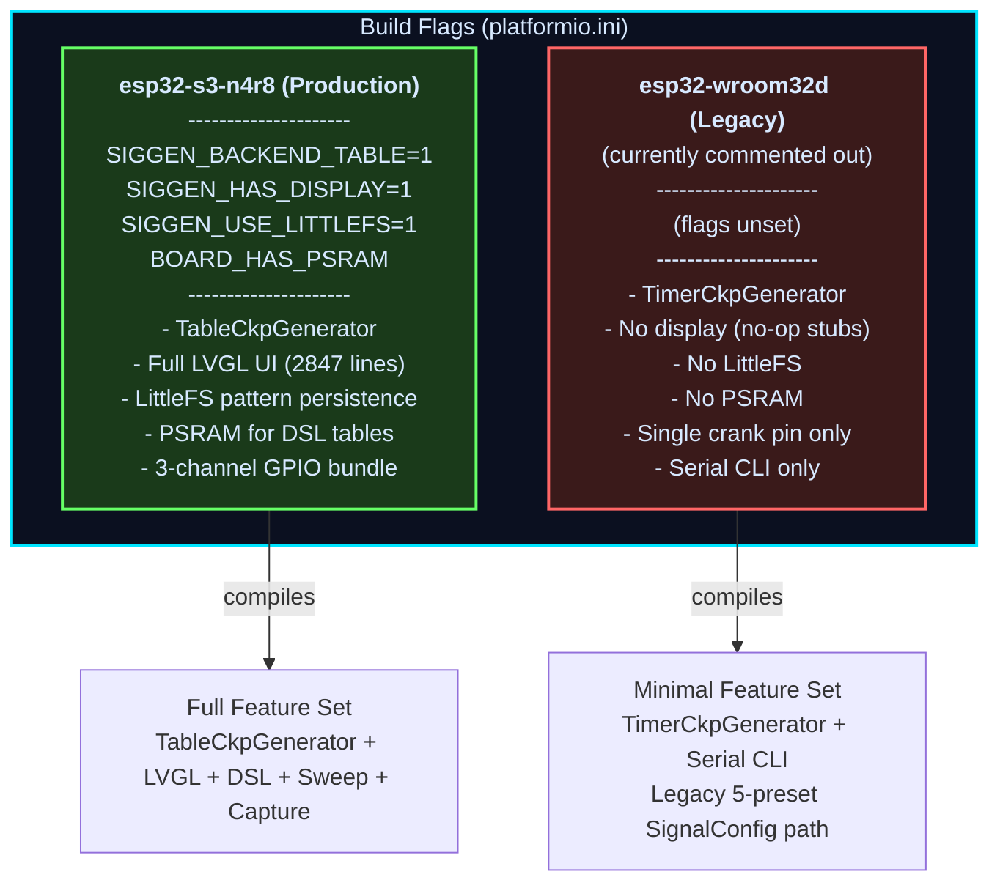

---

## Key C++ Concepts At Work

| Concept | Where | What It Does |
|---------|-------|-------------|
| **Abstract Interface (vtable)** | `IGenerator` | Defines the generator contract; `virtual` methods enable runtime polymorphism between `TimerCkpGenerator` and `TableCkpGenerator` |
| **Constructor / Destructor** | `TableCkpGenerator()` / `~TableCkpGenerator()` | Constructor zeros all fields; destructor frees PSRAM `_playback_buffer` and tears down GPTimer + dedic_gpio handles |
| **`static` Singleton Pattern** | `TimerCkpGenerator::s_inst` | ISR callback cannot capture `this` — a file-scope static pointer bridges the C callback to the C++ method |
| **`volatile` Qualifier** | `_edge_counter`, `_invert_mask`, `_cycle_start_us` | Tells the compiler not to optimize away reads — these are written by the ISR and read by other tasks/cores |
| **`portMUX_TYPE` Spinlock** | `s_ui_mux`, `g_dsl_error_mux` | ESP-IDF critical sections for cross-core access to small shared state (lighter than a mutex) |
| **FreeRTOS Queue** | `gCtrlQ` | Type-safe, ISR-safe message passing — the `CtrlMsg` union carries different payload types per `MsgType` |
| **`IRAM_ATTR`** | `TableCkpGenerator::onAlarm()` | Forces the ISR into internal RAM (not flash) — eliminates SPI flash cache-miss jitter during timing-critical operation |
| **`heap_caps_malloc(MALLOC_CAP_SPIRAM)`** | DSL Compiler output | Allocates the compiled byte table in PSRAM (8MB on S3), keeping internal SRAM free for stack and ISR buffers |
| **`constexpr` Arrays** | `CompressionTables.h`, `builtin_tables_generated.h` | Sin lookup tables and pattern byte arrays placed in `.rodata` at compile time — zero runtime initialization cost |
| **Tagged Union** | `MsgPayload` (union in `CtrlMsg`) | A single queue slot carries RPM values, SignalConfig structs, string pointers, raw byte tables, or sweep configs depending on `MsgType` |
| **Pending-Flag Sync Pattern** | `s_pending_rpm`, `s_pending_*` | Backend (Core 1) sets a volatile flag + value; UI thread (Core 0) reads and clears it inside a `portMUX` critical section — avoids LVGL reentrancy |
| **`extern "C"`** | `ui_get_active_pattern_for_wave()` | Prevents C++ name mangling so the LVGL `.c` callbacks can call into C++ code |
| **Build-Flag Polymorphism** | `#if defined(SIGGEN_BACKEND_TABLE)` | Compile-time selection of code paths — replaces the runtime cost of another vtable dispatch in the hot MSG handler |
| **`std::vector` in AST** | `WheelDef::runs`, `WheelDef::angular` | Parser uses heap-allocated dynamic arrays for variable-length DSL inputs; freed via `freeProgramAst()` |
